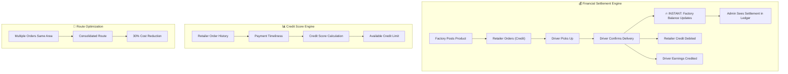

# 🏗️ C-Route: Architecture Analysis & Supabase Integration Plan

> **Salam Hack 2026 — Fintech Clearinghouse for Yemen's Wholesale Supply Chain**

---

## 1. Figma Design Decomposition

After scanning every file in the codebase, here's what I see:

### 1.1 Existing Component Inventory

| File | Lines | Role | UI Intent |
|------|-------|------|-----------|
| [RoleSelection.tsx](file:///d:/laragon/www/c-route/src/app/components/RoleSelection.tsx) | 316 | **Entry Point** — Role switcher with User/Investor mode toggle, 4 role cards (Factory, Retailer, Driver, Admin), animated entry overlay |
| [FactoryDashboard.tsx](file:///d:/laragon/www/c-route/src/app/components/FactoryDashboard.tsx) | 1434 | **Products CRUD** + Shipments table + Executive Analytics (Recharts) + **Wallet/Cash-Out** with pending settlements, linked bank accounts |
| [RetailerDashboard.tsx](file:///d:/laragon/www/c-route/src/app/components/RetailerDashboard.tsx) | 1354 | **Marketplace** with advanced filtering (by factory, route, financial terms) + Cart grouped by route + Order history + **Credit Score & Credit History** + Wallet |
| [DriverDashboard.tsx](file:///d:/laragon/www/c-route/src/app/components/DriverDashboard.tsx) | 889 | **Consolidated Route** with SVG route visualization + stop-by-stop timeline + QR barcode scanner + Earnings/wallet + Trip history + Performance stats |
| [AdminDashboard.tsx](file:///d:/laragon/www/c-route/src/app/components/AdminDashboard.tsx) | 1020 | **Clearinghouse Control Tower** — Live GMV stats (auto-updating), animated SVG Yemen map with routes, Transactions ledger, Credit Risk Monitor, Settlement Time analytics, Audit Log |
| [SupplyChainIntel.tsx](file:///d:/laragon/www/c-route/src/app/components/SupplyChainIntel.tsx) | 432 | **Heatmap/Fog-of-War** — SVG Yemen outline with heat blobs, animated truck flow paths, city demand ranking |

### 1.2 Design System Observations

- **Color Palette**: `#1A73E8` (primary blue), `#0B1B3B` (dark navy), `#15803D` (success green), `#B45309` (amber warning)
- **Typography**: IBM Plex Sans Arabic (set in RoleSelection), Tailwind v4 with custom theme CSS
- **UI Kit**: Full shadcn/ui component library (48 components in `/ui/`), Radix primitives, Framer Motion animations
- **Charts**: Recharts (Area, Bar, Pie, RadialBar, Line)
- **State**: All hardcoded mock data with `useState` — **zero backend connectivity**

---

## 2. Figma → Fintech Logic Mapping

Here's how each Figma screen maps to the **C-Route financial engine**:



### Key Business Flows Identified in Figma:

| Flow | Source Screen | Data Fields to Persist |
|------|-------------|----------------------|
| **Invoice Factoring (Cash-Out)** | Factory → Wallet tab | `pending_settlements`, `available_balance`, `linked_accounts`, `cashout_requests` |
| **Credit-Based Ordering** | Retailer → Market tab | `credit_limit`, `credit_used`, `credit_score`, `grace_period`, `payment_history` |
| **Consolidated Routes** | Driver → Route tab | `route_stops[]`, `pickup/dropoff_status`, `barcode_scan_proof`, `earnings_per_stop` |
| **Clearinghouse Ledger** | Admin → Transactions tab | `transaction_id`, `from/to`, `amount`, `fee`, `type`, `status`, `timestamp` |
| **Risk Monitor** | Admin → Risk tab | `retailer_id`, `risk_level`, `credit_score`, `utilization_pct` |

---

## 3. Proposed Supabase Schema

> [!IMPORTANT]
> This schema is inferred directly from the UI fields in your Figma export. Every field maps to something visible on screen.

```sql
-- ═══════════════════════════════════════════
-- CORE ENTITIES
-- ═══════════════════════════════════════════

-- Factories (المصانع)
CREATE TABLE factories (
  id UUID PRIMARY KEY DEFAULT gen_random_uuid(),
  name TEXT NOT NULL,
  city TEXT NOT NULL DEFAULT 'صنعاء',
  balance BIGINT NOT NULL DEFAULT 0,          -- Available balance (ر.ي)
  pending_balance BIGINT NOT NULL DEFAULT 0,  -- Awaiting settlement
  rating NUMERIC(3,2) DEFAULT 0,
  tier TEXT DEFAULT 'gold',                   -- gold/silver/bronze
  created_at TIMESTAMPTZ DEFAULT now()
);

-- Retailers (التجار)
CREATE TABLE retailers (
  id UUID PRIMARY KEY DEFAULT gen_random_uuid(),
  name TEXT NOT NULL,
  city TEXT NOT NULL DEFAULT 'صنعاء',
  credit_limit BIGINT NOT NULL DEFAULT 500000,
  credit_used BIGINT NOT NULL DEFAULT 0,
  credit_score INT NOT NULL DEFAULT 75,       -- 0-100 ★ THE STAR
  grace_period_days INT DEFAULT 45,
  next_payment_date DATE,
  next_payment_amount BIGINT DEFAULT 0,
  created_at TIMESTAMPTZ DEFAULT now()
);

-- Drivers (السائقون)
CREATE TABLE drivers (
  id UUID PRIMARY KEY DEFAULT gen_random_uuid(),
  name TEXT NOT NULL,
  phone TEXT,
  total_trips INT DEFAULT 0,
  total_distance INT DEFAULT 0,
  avg_rating NUMERIC(3,2) DEFAULT 4.8,
  on_time_pct INT DEFAULT 96,
  balance BIGINT DEFAULT 0,
  pending_earnings BIGINT DEFAULT 0,
  rank INT DEFAULT 1,
  created_at TIMESTAMPTZ DEFAULT now()
);

-- Products (المنتجات)
CREATE TABLE products (
  id UUID PRIMARY KEY DEFAULT gen_random_uuid(),
  factory_id UUID REFERENCES factories(id) ON DELETE CASCADE,
  name TEXT NOT NULL,
  category TEXT NOT NULL,
  unit TEXT NOT NULL,
  quantity INT NOT NULL DEFAULT 0,
  price BIGINT NOT NULL,                      -- per unit in ر.ي
  barcode TEXT,
  expiry_date DATE,
  description TEXT,
  min_stock INT DEFAULT 0,
  image_url TEXT,
  created_at TIMESTAMPTZ DEFAULT now()
);

-- ═══════════════════════════════════════════
-- ORDERS & LOGISTICS
-- ═══════════════════════════════════════════

-- Orders (الطلبات)
CREATE TABLE orders (
  id UUID PRIMARY KEY DEFAULT gen_random_uuid(),
  order_number TEXT UNIQUE NOT NULL,          -- e.g., ORD-2341
  retailer_id UUID REFERENCES retailers(id),
  route TEXT,                                 -- المسار A/B/C
  status TEXT DEFAULT 'pending',              -- pending/processing/shipped/delivered/cancelled
  total BIGINT NOT NULL DEFAULT 0,
  credit_used BIGINT NOT NULL DEFAULT 0,
  delivery_date DATE,
  created_at TIMESTAMPTZ DEFAULT now()
);

-- Order Items
CREATE TABLE order_items (
  id UUID PRIMARY KEY DEFAULT gen_random_uuid(),
  order_id UUID REFERENCES orders(id) ON DELETE CASCADE,
  product_id UUID REFERENCES products(id),
  quantity INT NOT NULL,
  unit_price BIGINT NOT NULL,
  subtotal BIGINT GENERATED ALWAYS AS (quantity * unit_price) STORED
);

-- Shipments (الشحنات)
CREATE TABLE shipments (
  id UUID PRIMARY KEY DEFAULT gen_random_uuid(),
  shipment_number TEXT UNIQUE NOT NULL,       -- e.g., SH-001
  factory_id UUID REFERENCES factories(id),
  driver_id UUID REFERENCES drivers(id),
  route TEXT NOT NULL,
  status TEXT DEFAULT 'pending',              -- pending/in_transit/delivered
  total_amount BIGINT DEFAULT 0,
  created_at TIMESTAMPTZ DEFAULT now()
);

-- Route Stops (نقاط المسار)
CREATE TABLE route_stops (
  id UUID PRIMARY KEY DEFAULT gen_random_uuid(),
  shipment_id UUID REFERENCES shipments(id) ON DELETE CASCADE,
  stop_order INT NOT NULL,
  type TEXT NOT NULL,                         -- pickup / dropoff
  location_name TEXT NOT NULL,
  address TEXT,
  city TEXT,
  contact_name TEXT,
  contact_phone TEXT,
  items_description TEXT,
  status TEXT DEFAULT 'pending',              -- pending/current/completed
  earnings BIGINT DEFAULT 0,
  completed_at TIMESTAMPTZ,
  proof_image_url TEXT
);

-- ═══════════════════════════════════════════
-- FINANCIAL SETTLEMENT (THE CORE ENGINE)
-- ═══════════════════════════════════════════

-- Transactions Ledger (دفتر المعاملات)
CREATE TABLE transactions (
  id UUID PRIMARY KEY DEFAULT gen_random_uuid(),
  tx_number TEXT UNIQUE NOT NULL,             -- e.g., TX-8821
  from_entity TEXT NOT NULL,
  to_entity TEXT NOT NULL,
  amount BIGINT NOT NULL,
  fee BIGINT DEFAULT 0,                       -- Platform fee (1%)
  type TEXT NOT NULL,                         -- settlement/credit/fee/cashout
  status TEXT DEFAULT 'pending',              -- pending/completed/failed
  related_shipment_id UUID REFERENCES shipments(id),
  created_at TIMESTAMPTZ DEFAULT now()
);

-- Cashout Requests (طلبات السحب) ★ FACTORY STAR FEATURE
CREATE TABLE cashout_requests (
  id UUID PRIMARY KEY DEFAULT gen_random_uuid(),
  factory_id UUID REFERENCES factories(id),
  amount BIGINT NOT NULL,
  bank_name TEXT,
  bank_account TEXT,
  status TEXT DEFAULT 'pending',              -- pending/processing/completed
  created_at TIMESTAMPTZ DEFAULT now(),
  completed_at TIMESTAMPTZ
);

-- Credit History (سجل الائتمان) ★ RETAILER STAR FEATURE
CREATE TABLE credit_history (
  id UUID PRIMARY KEY DEFAULT gen_random_uuid(),
  retailer_id UUID REFERENCES retailers(id),
  type TEXT NOT NULL,                         -- usage/payment
  amount BIGINT NOT NULL,
  description TEXT,
  balance_after BIGINT NOT NULL,
  created_at TIMESTAMPTZ DEFAULT now()
);

-- ═══════════════════════════════════════════
-- ADMIN / INTELLIGENCE
-- ═══════════════════════════════════════════

-- Audit Log (سجل التدقيق)
CREATE TABLE audit_log (
  id UUID PRIMARY KEY DEFAULT gen_random_uuid(),
  action TEXT NOT NULL,
  actor TEXT NOT NULL,
  target TEXT,
  type TEXT,                                  -- settlement/approval/update/user
  created_at TIMESTAMPTZ DEFAULT now()
);

-- Platform Stats (مؤشرات المنصة) — Materialized view / cached
CREATE TABLE platform_stats (
  id INT PRIMARY KEY DEFAULT 1,
  gmv BIGINT DEFAULT 0,
  daily_settlements BIGINT DEFAULT 0,
  active_users INT DEFAULT 0,
  active_shipments INT DEFAULT 0,
  total_transactions INT DEFAULT 0,
  avg_settlement_hours NUMERIC(4,2) DEFAULT 1.8,
  platform_fee_today BIGINT DEFAULT 0,
  updated_at TIMESTAMPTZ DEFAULT now()
);
```

---

## 4. Integration Strategy (Without Breaking the Design)

> [!TIP]
> The "Hackathon Golden Path" — we keep your Figma design pixel-perfect and surgically inject Supabase behind it.

### Phase 1: Foundation (30 min)
1. **Create Supabase project** "C-Route" 
2. **Run the migration** above to create all tables
3. **Seed with the exact mock data** already in your components (so the UI looks identical on first load)
4. **Install `@supabase/supabase-js`** + create a `lib/supabase.ts` client

### Phase 2: Data Layer (1-2 hours)
Create React hooks that replace the hardcoded arrays:

```
src/
  lib/
    supabase.ts              # Supabase client
  hooks/
    useProducts.ts            # Factory products CRUD
    useOrders.ts              # Retailer orders
    useShipments.ts           # Shipments + route stops
    useWallet.ts              # Factory wallet + cashout
    useCreditScore.ts         # Retailer credit engine
    useDriverRoute.ts         # Driver current route + stops
    useTransactions.ts        # Admin ledger (real-time)
    usePlatformStats.ts       # Admin KPIs (real-time)
    useRiskMonitor.ts         # Credit risk per retailer
```

### Phase 3: Real-Time Settlement (THE WOW MOMENT) ★
```
Driver confirms delivery
       ↓
  Supabase trigger fires
       ↓
  ┌─────────────────────────┐
  │ Factory.balance += amount│  ← Factory sees instant update
  │ Retailer.credit -= amount│  ← Retailer credit debited
  │ Driver.earnings += fee   │  ← Driver gets paid
  │ Transaction record created│  ← Admin sees in ledger
  └─────────────────────────┘
       ↓
  Supabase Realtime broadcast
       ↓
  ALL dashboards update live
```

### Phase 4: Star Features Polish (1 hour)
- **Factory Cash-Out Flow**: Click "سحب فوري" → creates `cashout_request` → updates balance → new transaction in ledger
- **Retailer Credit Score Visualization**: Calculate from `credit_history` — payment timeliness, utilization ratio, order frequency
- **Admin Heatmap**: Wire `SupplyChainIntel` to real data from orders grouped by city

---

## 5. What We Keep vs. What We Replace

| Aspect | Keep ✅ | Replace/Enhance 🔄 |
|--------|---------|-------------------|
| Figma design & layout | All Tailwind classes, animations, Framer Motion | — |
| shadcn/ui components | All 48 components | — |
| Recharts charts | Chart components | Data source → Supabase queries |
| Yemen SVG map | SupplyChainIntel SVG | City data → from orders table |
| Role Switcher | RoleSelection component | — |
| Mock data arrays | — | Replace with `useQuery` hooks |
| `useState` for products | — | Supabase CRUD with real-time |
| Settlement simulation | — | Supabase triggers + realtime |
| Admin live stats | `setInterval` simulation | Supabase realtime subscriptions |

---

## 6. File Structure After Refactoring

```
src/
├── app/
│   ├── App.tsx                          # Keep role switcher
│   └── components/
│       ├── RoleSelection.tsx            # Untouched
│       ├── factory/
│       │   ├── FactoryDashboard.tsx      # Slim orchestrator
│       │   ├── ProductsTab.tsx           # Extracted
│       │   ├── ShipmentsTab.tsx          # Extracted
│       │   ├── AnalyticsTab.tsx          # Extracted
│       │   └── WalletTab.tsx             # ★ Cash-out flow
│       ├── retailer/
│       │   ├── RetailerDashboard.tsx     
│       │   ├── MarketTab.tsx             # Marketplace
│       │   ├── OrdersTab.tsx             
│       │   ├── CreditTab.tsx             # ★ Credit score viz
│       │   └── WalletTab.tsx             
│       ├── driver/
│       │   ├── DriverDashboard.tsx       
│       │   ├── RouteTab.tsx              # Consolidated route
│       │   ├── EarningsTab.tsx           
│       │   └── StatsTab.tsx              
│       ├── admin/
│       │   ├── AdminDashboard.tsx        
│       │   ├── OverviewTab.tsx           
│       │   ├── TransactionsTab.tsx       
│       │   ├── RiskTab.tsx               
│       │   └── AuditTab.tsx              
│       ├── shared/
│       │   ├── SupplyChainIntel.tsx      # Heatmap
│       │   ├── KpiCard.tsx              
│       │   └── Legend.tsx               
│       ├── figma/
│       │   └── ImageWithFallback.tsx     
│       └── ui/                           # All 48 shadcn components
├── hooks/                                # All Supabase hooks
├── lib/
│   └── supabase.ts                       # Client init
├── styles/
│   ├── fonts.css
│   ├── globals.css
│   ├── index.css
│   ├── tailwind.css
│   └── theme.css
└── main.tsx
```

---

## 7. Risk Assessment & Data Integrity

> [!WARNING]
> In Fintech, *every* number must be auditable. Here's how we ensure trust:

1. **Transactions are append-only** — No UPDATE/DELETE on the `transactions` table
2. **Balance updates via DB triggers** — Never let the frontend calculate balances
3. **Double-entry bookkeeping** — Every settlement creates paired debit/credit records
4. **Optimistic locking** — Use `updated_at` timestamps to prevent race conditions on cashouts
5. **Audit trail** — Every state change logged to `audit_log`

---

## 8. Next Steps — Your Call

> [!NOTE]
> I'm ready to execute. Tell me which path:

### Option A: "Full Send" 🚀
I create the Supabase project, run migrations, seed data, install dependencies, create all hooks, wire up the dashboards, and implement the real-time settlement engine — end-to-end.

### Option B: "Foundation First" 🏗️
I set up Supabase + schema + seed data first, then we iterate dashboard-by-dashboard.

### Option C: "Stars Only" ⭐
I focus exclusively on the two demo-winning features:
1. Factory Cash-Out flow (Invoice Factoring)
2. Retailer Credit Score visualization

**Which option? Or a custom combination?**
